# Diagramme de Cas d'Utilisation - Système SGIC

## Diagramme Mermaid

```mermaid
graph TB
    subgraph System["Système SGIC"]
        direction TB
        UC1(("Se connecter"))
        UC2(("Gérer les fiches criminelles"))
        UC3(("Gérer les enquêtes"))
        UC4(("Gérer la biométrie"))
        UC5(("Reconnaissance faciale"))
        UC6(("Analyse prédictive IA"))
        UC7(("Générer des rapports"))
        UC8(("Consulter les statistiques"))
        UC9(("Gérer les utilisateurs"))
        UC10(("Consulter l'audit"))
        UC11(("Rechercher des informations"))
        UC12(("Vérifier l'identité"))
    end

    Admin[("👤 Administrateur")]
    EnqPrinc[("👤 Enquêteur Principal")]
    Analyste[("👤 Analyste")]
    Observateur[("👤 Observateur")]
    
    Auth[("🔐 Authentification<br/>&lt;&lt;service&gt;&gt;")]
    IA[("🤖 Service IA<br/>&lt;&lt;service&gt;&gt;")]
    Biometrie[("🔬 Service Biométrie<br/>&lt;&lt;service&gt;&gt;")]
    BaseDonnees[("💾 Base de données<br/>&lt;&lt;service&gt;&gt;")]

    %% Associations Administrateur
    Admin --- UC1
    Admin --- UC2
    Admin --- UC3
    Admin --- UC4
    Admin --- UC5
    Admin --- UC6
    Admin --- UC7
    Admin --- UC8
    Admin --- UC9
    Admin --- UC10
    Admin --- UC11

    %% Associations Enquêteur Principal
    EnqPrinc --- UC1
    EnqPrinc --- UC2
    EnqPrinc --- UC3
    EnqPrinc --- UC4
    EnqPrinc --- UC5
    EnqPrinc --- UC6
    EnqPrinc --- UC7
    EnqPrinc --- UC8
    EnqPrinc --- UC11
    EnqPrinc --- UC12

    %% Associations Analyste
    Analyste --- UC1
    Analyste --- UC2
    Analyste --- UC4
    Analyste --- UC6
    Analyste --- UC7
    Analyste --- UC8
    Analyste --- UC11

    %% Associations Observateur
    Observateur --- UC1
    Observateur --- UC2
    Observateur --- UC3
    Observateur --- UC4
    Observateur --- UC7
    Observateur --- UC8
    Observateur --- UC11

    %% Services externes
    Auth --- UC1
    IA --- UC5
    IA --- UC6
    Biometrie --- UC4
    Biometrie --- UC5
    Biometrie --- UC12
    BaseDonnees --- UC2
    BaseDonnees --- UC3
    BaseDonnees --- UC4
    BaseDonnees --- UC7
    BaseDonnees --- UC8
    BaseDonnees --- UC10
    BaseDonnees --- UC11

    %% Relations include
    UC2 -.->|"<<include>>"| UC1
    UC3 -.->|"<<include>>"| UC1
    UC4 -.->|"<<include>>"| UC1
    UC5 -.->|"<<include>>"| UC4
    UC6 -.->|"<<include>>"| UC1
    UC7 -.->|"<<include>>"| UC1
    UC8 -.->|"<<include>>"| UC1
    UC9 -.->|"<<include>>"| UC1
    UC10 -.->|"<<include>>"| UC1
    UC11 -.->|"<<include>>"| UC1
    UC12 -.->|"<<include>>"| UC4
    UC12 -.->|"<<include>>"| UC5

    style System fill:#f9f9f9,stroke:#333,stroke-width:3px
    style UC1 fill:#e1f5ff,stroke:#01579b,stroke-width:2px
    style UC2 fill:#fff4e1,stroke:#e65100,stroke-width:2px
    style UC3 fill:#fff4e1,stroke:#e65100,stroke-width:2px
    style UC4 fill:#e8f5e9,stroke:#2e7d32,stroke-width:2px
    style UC5 fill:#f3e5f5,stroke:#6a1b9a,stroke-width:2px
    style UC6 fill:#f3e5f5,stroke:#6a1b9a,stroke-width:2px
    style UC7 fill:#fff9c4,stroke:#f57f17,stroke-width:2px
    style UC8 fill:#fff9c4,stroke:#f57f17,stroke-width:2px
    style UC9 fill:#ffebee,stroke:#c62828,stroke-width:2px
    style UC10 fill:#ffebee,stroke:#c62828,stroke-width:2px
    style UC11 fill:#e0f2f1,stroke:#00695c,stroke-width:2px
    style UC12 fill:#e8f5e9,stroke:#2e7d32,stroke-width:2px
```

## Version alternative (sans emojis - meilleure compatibilité)

```mermaid
graph TB
    subgraph System["Système SGIC"]
        direction TB
        UC1(("Se connecter"))
        UC2(("Gérer les fiches criminelles"))
        UC3(("Gérer les enquêtes"))
        UC4(("Gérer la biométrie"))
        UC5(("Reconnaissance faciale"))
        UC6(("Analyse prédictive IA"))
        UC7(("Générer des rapports"))
        UC8(("Consulter les statistiques"))
        UC9(("Gérer les utilisateurs"))
        UC10(("Consulter l'audit"))
        UC11(("Rechercher des informations"))
        UC12(("Vérifier l'identité"))
    end

    Admin[("Administrateur")]
    EnqPrinc[("Enquêteur Principal")]
    Analyste[("Analyste")]
    Observateur[("Observateur")]
    
    Auth[("Authentification<br/>&lt;&lt;service&gt;&gt;")]
    IA[("Service IA<br/>&lt;&lt;service&gt;&gt;")]
    Biometrie[("Service Biométrie<br/>&lt;&lt;service&gt;&gt;")]
    BaseDonnees[("Base de données<br/>&lt;&lt;service&gt;&gt;")]

    Admin --- UC1
    Admin --- UC2
    Admin --- UC3
    Admin --- UC4
    Admin --- UC5
    Admin --- UC6
    Admin --- UC7
    Admin --- UC8
    Admin --- UC9
    Admin --- UC10
    Admin --- UC11

    EnqPrinc --- UC1
    EnqPrinc --- UC2
    EnqPrinc --- UC3
    EnqPrinc --- UC4
    EnqPrinc --- UC5
    EnqPrinc --- UC6
    EnqPrinc --- UC7
    EnqPrinc --- UC8
    EnqPrinc --- UC11
    EnqPrinc --- UC12

    Analyste --- UC1
    Analyste --- UC2
    Analyste --- UC4
    Analyste --- UC6
    Analyste --- UC7
    Analyste --- UC8
    Analyste --- UC11

    Observateur --- UC1
    Observateur --- UC2
    Observateur --- UC3
    Observateur --- UC4
    Observateur --- UC7
    Observateur --- UC8
    Observateur --- UC11

    Auth --- UC1
    IA --- UC5
    IA --- UC6
    Biometrie --- UC4
    Biometrie --- UC5
    Biometrie --- UC12
    BaseDonnees --- UC2
    BaseDonnees --- UC3
    BaseDonnees --- UC4
    BaseDonnees --- UC7
    BaseDonnees --- UC8
    BaseDonnees --- UC10
    BaseDonnees --- UC11

    UC2 -.->|"<<include>>"| UC1
    UC3 -.->|"<<include>>"| UC1
    UC4 -.->|"<<include>>"| UC1
    UC5 -.->|"<<include>>"| UC4
    UC6 -.->|"<<include>>"| UC1
    UC7 -.->|"<<include>>"| UC1
    UC8 -.->|"<<include>>"| UC1
    UC9 -.->|"<<include>>"| UC1
    UC10 -.->|"<<include>>"| UC1
    UC11 -.->|"<<include>>"| UC1
    UC12 -.->|"<<include>>"| UC4
    UC12 -.->|"<<include>>"| UC5

    style System fill:#f9f9f9,stroke:#333,stroke-width:3px
    style UC1 fill:#e1f5ff,stroke:#01579b,stroke-width:2px
    style UC2 fill:#fff4e1,stroke:#e65100,stroke-width:2px
    style UC3 fill:#fff4e1,stroke:#e65100,stroke-width:2px
    style UC4 fill:#e8f5e9,stroke:#2e7d32,stroke-width:2px
    style UC5 fill:#f3e5f5,stroke:#6a1b9a,stroke-width:2px
    style UC6 fill:#f3e5f5,stroke:#6a1b9a,stroke-width:2px
    style UC7 fill:#fff9c4,stroke:#f57f17,stroke-width:2px
    style UC8 fill:#fff9c4,stroke:#f57f17,stroke-width:2px
    style UC9 fill:#ffebee,stroke:#c62828,stroke-width:2px
    style UC10 fill:#ffebee,stroke:#c62828,stroke-width:2px
    style UC11 fill:#e0f2f1,stroke:#00695c,stroke-width:2px
    style UC12 fill:#e8f5e9,stroke:#2e7d32,stroke-width:2px
```

## Légende

### Acteurs
- **Administrateur** : Accès complet à toutes les fonctionnalités
- **Enquêteur Principal** : Gestion complète des enquêtes et fiches criminelles
- **Analyste** : Consultation + génération de rapports + analyse IA
- **Observateur** : Consultation seule (transparence)

### Cas d'utilisation
1. **Se connecter** : Authentification au système
2. **Gérer les fiches criminelles** : CRUD des fiches criminelles
3. **Gérer les enquêtes** : CRUD des dossiers d'enquête
4. **Gérer la biométrie** : Enregistrement photos et empreintes
5. **Reconnaissance faciale** : Identification par IA
6. **Analyse prédictive IA** : Prédictions et patterns
7. **Générer des rapports** : Création et export de rapports
8. **Consulter les statistiques** : Tableaux de bord et indicateurs
9. **Gérer les utilisateurs** : Administration des comptes (Admin uniquement)
10. **Consulter l'audit** : Traçabilité des actions
11. **Rechercher des informations** : Recherche avancée
12. **Vérifier l'identité** : Vérification biométrique

### Services externes
- **Authentification** : Service d'authentification JWT
- **Service IA** : Modèles de reconnaissance faciale et analyse prédictive
- **Service Biométrie** : Traitement des données biométriques
- **Base de données** : PostgreSQL

### Relations
- **Association** (ligne pleine) : L'acteur peut utiliser le cas d'utilisation
- **Include** (ligne pointillée avec flèche) : Le cas d'utilisation inclut un autre cas d'utilisation
